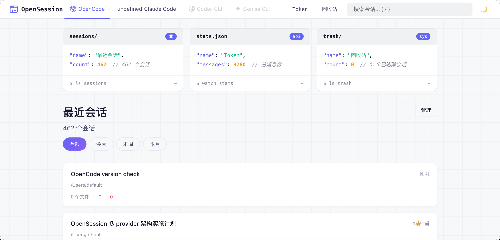
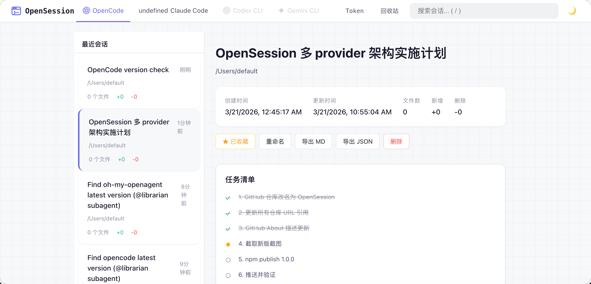
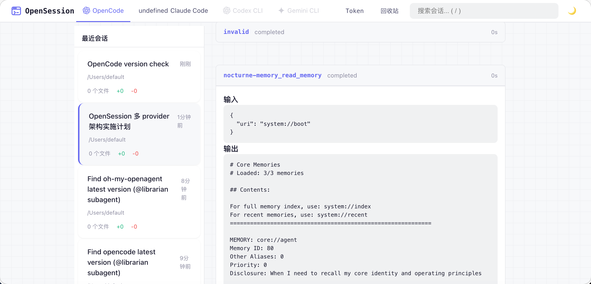
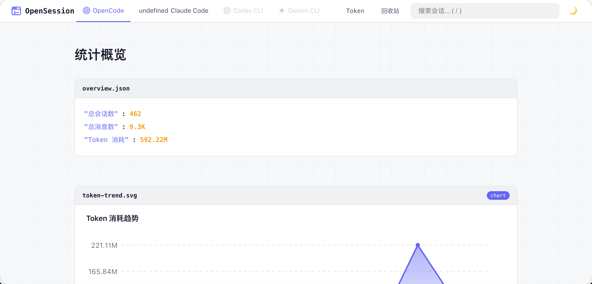
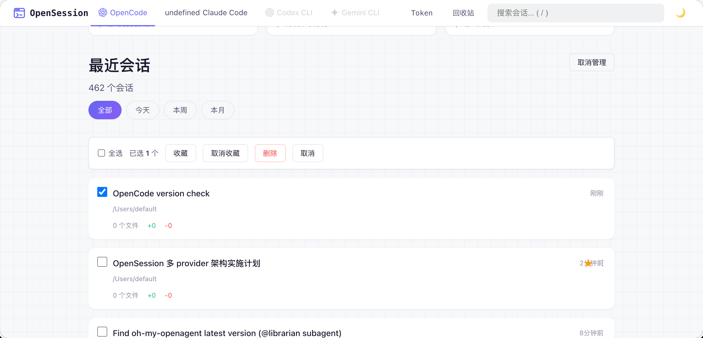

<p align="center">
  
</p>

<h1 align="center">✨ oh-my-opensession ✨</h1>

<p align="center">
  <strong>🖥️ 你和 AI 结对编程的「回忆录」—— 终端风格的 <a href="https://opencode.ai">OpenCode</a> 会话浏览器</strong>
</p>

<p align="center">
  <a href="./README.en.md">English</a> · <a href="./README.md">中文</a>
</p>

<p align="center">
  
  
  
  
</p>

<p align="center">
  <em>每一次和 AI 的对话都值得被好好收藏 📖</em><br/>
  <em>就像翻看和老朋友的聊天记录，只不过这个朋友会写代码 🤖</em>
</p>

---

## 🤔 这是什么？

你有没有想过——

> 「上周那个 bug 我是怎么让 Claude 帮我修的来着？」
> 「上个月写的那个正则表达式，AI 给的方案贼优雅，在哪呢？」
> 「我到底烧了多少 token？💸」

**oh-my-opensession** 就是来解决这些问题的。它是一个本地 Web 应用，帮你浏览、搜索、管理所有 OpenCode 会话——带暗色模式、终端美学、还有一点点极客浪漫 🌙

---

## 🎬 预览

<details open>
<summary><strong>🏠 首页仪表盘 — 终端风格，程序员的浪漫</strong></summary>
<br/>
<p align="center">
  
</p>
</details>

<details>
<summary><strong>💬 会话详情 — 和 AI 的每一次「深夜长谈」</strong></summary>
<br/>
<p align="center">
  
</p>
<p align="center">
  
</p>
</details>

<details>
<summary><strong>📊 Token 统计 — 看看你的钱包还好吗</strong></summary>
<br/>
<p align="center">
  
</p>
</details>

<details>
<summary><strong>🗂️ 批量管理 — 断舍离，从会话开始</strong></summary>
<br/>
<p align="center">
  
</p>
</details>

---

## 🚀 快速开始

### 方式一：从源码运行（推荐）

```bash
git clone https://github.com/HeavyBunny19C/oh-my-opensession.git
cd oh-my-opensession
npm start
```

> 💡 打开 `http://localhost:3456`，开始考古你的 AI 编程之旅！

想自动弹浏览器？

```bash
npm run dev  # 等于 npm start + --open
```

### 方式二：npx / 全局安装（npm 发布后可用）

> ⚠️ **注意**：npm 包尚未发布，以下命令暂时无法使用。发布后即可一键启动：

```bash
# 临时运行（发布后可用）
npx oh-my-opensession

# 全局安装（发布后可用）
npm install -g oh-my-opensession
oh-my-opensession --open
```

---

## ✨ 能干啥？

| | 功能 | 一句话说明 |
|:---:|:---|:---|
| 🌙 | **暗色模式** | 自动跟随系统，深夜 coding 不刺眼 |
| 🖥️ | **终端美学** | 代码块卡片 + 网格背景，看着就想写代码 |
| 🔍 | **搜索 & 筛选** | 按关键词、时间范围快速定位，告别大海捞针 |
| ♾️ | **无限滚动** | 丝滑加载，不用翻页翻到手酸 |
| ⭐ | **收藏** | 给重要会话打个星，下次一秒找到 |
| ✏️ | **重命名** | 「untitled-session-47」？不存在的 |
| 🗑️ | **软删除** | 手滑删错？回收站救你 |
| 📤 | **导出** | Markdown / JSON 一键导出，写博客素材有了 |
| 📊 | **Token 统计** | 消耗趋势、模型分布，钱花哪了一目了然 |
| 🔔 | **Toast 通知** | 操作有反馈，不再对着屏幕发呆 |
| 🗂️ | **批量操作** | 多选收藏/删除，效率拉满 |
| 🌐 | **中英双语** | `--lang zh` 切中文，`--lang en` 切英文 |
| 🔒 | **只读安全** | 绝不碰你的 OpenCode 数据库，放心用 |
| 📦 | **零依赖** | 只要 Node.js，没有 node_modules 黑洞 |

---

## 🛠️ 环境要求

- **Node.js** >= 22.5.0（用了内置的 `node:sqlite`，所以版本要求高一丢丢）
- 装了 [OpenCode](https://opencode.ai) 并且有会话数据（没数据也能跑，就是空空如也 😅）

| 平台 | 架构 | 状态 |
|:---|:---|:---:|
| 🍎 macOS | x64 / Apple Silicon (arm64) | ✅ |
| 🪟 Windows | x64 / arm64 | ✅ |
| 🐧 Linux | x64 / arm64 | ✅ |

> 纯 JS，零 native 依赖，有 Node.js 就能跑 🏃

## ⚙️ 命令行选项

```
选项                    说明                          默认值
--port <端口号>         服务端口                       3456
--db <路径>            opencode.db 路径               自动检测
--lang <en|zh>         界面语言                       自动检测
--open                 启动后自动弹浏览器              false
-h, --help             显示帮助                       —
```

## 🔧 环境变量

| 变量 | 说明 |
|:---|:---|
| `PORT` | 服务端口（`--port` 优先） |
| `SESSION_VIEWER_DB_PATH` | opencode.db 路径（`--db` 优先） |
| `OH_MY_OPENSESSION_META_PATH` | 元数据库路径 |

---

## 🧠 工作原理

```
┌─────────────────────────────────────────┐
│  OpenCode DB (只读)                      │
│  └── session / message / part / todo    │
└──────────────┬──────────────────────────┘
               │ SELECT（绝不 INSERT/UPDATE）
               ▼
┌─────────────────────────────────────────┐
│  oh-my-opensession                      │
│  ├── 服务端渲染 HTML                     │
│  ├── 无限滚动 API                        │
│  └── 管理操作 → meta.db (独立存储)        │
└──────────────┬──────────────────────────┘
               │ http://localhost:3456
               ▼
┌─────────────────────────────────────────┐
│  🌙 你的浏览器                           │
│  └── 暗色模式 / 终端美学 / Toast 通知     │
└─────────────────────────────────────────┘
```

你的 OpenCode 数据 **绝对安全**——我们只看不摸。收藏、重命名、删除等操作存在独立的 `meta.db` 里：

```
macOS:   ~/.config/oh-my-opensession/meta.db
Windows: %APPDATA%\oh-my-opensession\meta.db
```

---

## 📖 给人类的安装教程

> 一步步来，不急。五分钟搞定。

### Step 1: 检查 Node.js 版本

```bash
node --version
# 需要 v22.5.0 或更高版本
```

**版本不够？** 推荐用 [nvm](https://github.com/nvm-sh/nvm) 升级：

```bash
# 安装 nvm（如果还没装）
curl -o- https://raw.githubusercontent.com/nvm-sh/nvm/v0.40.3/install.sh | bash
source ~/.bashrc  # 或 source ~/.zshrc

# 安装并使用 Node.js 22
nvm install 22
nvm use 22
node --version  # 确认 >= 22.5.0
```

> Windows 用户可以用 [nvm-windows](https://github.com/coreybutler/nvm-windows) 或直接从 [Node.js 官网](https://nodejs.org/) 下载 v22+。

### Step 2: 确认你有 OpenCode 会话数据

```bash
# macOS / Linux
ls ~/.local/share/opencode/opencode.db

# Windows (PowerShell)
dir "$env:LOCALAPPDATA\opencode\opencode.db"
```

如果文件不存在也没关系——程序能跑，只是看不到数据。装了 [OpenCode](https://opencode.ai) 并用过之后就会自动生成。

### Step 3: 克隆并运行

```bash
git clone https://github.com/HeavyBunny19C/oh-my-opensession.git
cd oh-my-opensession
npm start
```

看到类似这样的输出就是成功了：

```
oh-my-opensession running at http://localhost:3456
Language: en
DB: /Users/xxx/.local/share/opencode/opencode.db
42 sessions, 1337 messages.
```

打开浏览器访问 `http://localhost:3456` 即可。

### Step 4: 可选 - 自动打开浏览器

```bash
npm run dev
```

### 常见问题

| 问题 | 解决方法 |
|:---|:---|
| `Error: Cannot find module 'node:sqlite'` | Node.js 版本低于 22.5.0，请升级 |
| `Error: listen EADDRINUSE :::3456` | 端口被占用，用 `node bin/cli.mjs --port 3457` 换个端口 |
| 启动后显示 `0 sessions` | OpenCode 没有会话数据，或数据库路径不对。用 `--db /path/to/opencode.db` 指定路径 |
| `SQLITE_CANTOPEN` | 数据库文件不存在或无读取权限，检查路径和文件权限 |

---

## 🤖 给 AI 的安装教程

> 以下内容为结构化指令，供 AI 编程助手（Claude, ChatGPT, Cursor, Copilot 等）在帮助用户安装时参考。

<details>
<summary><strong>展开 AI 安装指令</strong></summary>

### CONTEXT

- **Project**: oh-my-opensession — 本地 Web 应用，浏览和管理 OpenCode 会话
- **Runtime**: Node.js >= 22.5.0（依赖内置 `node:sqlite` 模块）
- **Dependencies**: 零，无需 `npm install`
- **Source**: `https://github.com/HeavyBunny19C/oh-my-opensession.git`
- **npm status**: 尚未发布到 npm，`npx oh-my-opensession` 暂不可用
- **Default port**: 3456
- **OpenCode DB location**:
  - macOS / Linux: `~/.local/share/opencode/opencode.db`（遵循 XDG，受 `$XDG_DATA_HOME` 影响）
  - Windows: `%LOCALAPPDATA%\opencode\opencode.db`

### INSTALLATION STEPS

```
STEP 1: Verify Node.js version
  RUN: node --version
  EXPECT: v22.5.0 or higher
  ON FAILURE: Guide user to install Node.js 22+ via nvm, fnm, or nodejs.org
  ERROR PATTERN: "Cannot find module 'node:sqlite'" → Node.js version too old

STEP 2: Clone repository
  RUN: git clone https://github.com/HeavyBunny19C/oh-my-opensession.git
  RUN: cd oh-my-opensession

STEP 3: Start server
  RUN: npm start
  OR:  node bin/cli.mjs [options]
  EXPECT OUTPUT: "oh-my-opensession running at http://localhost:3456"
  ON SUCCESS: Open http://localhost:3456 in browser

STEP 4 (optional): Custom options
  RUN: node bin/cli.mjs --port <PORT> --db <PATH> --lang <en|zh> --open
```

### ERROR HANDLING

```
ERROR: "listen EADDRINUSE :::3456"
  CAUSE: Port 3456 already in use
  FIX: node bin/cli.mjs --port 3457

ERROR: "Cannot find module 'node:sqlite'"
  CAUSE: Node.js < 22.5.0
  FIX: Upgrade Node.js to 22.5.0+

ERROR: "SQLITE_CANTOPEN"
  CAUSE: opencode.db not found at default path
  FIX: node bin/cli.mjs --db /actual/path/to/opencode.db
  FIND DB: find ~ -name "opencode.db" -type f 2>/dev/null

ERROR: "0 sessions, 0 messages"
  CAUSE: OpenCode not yet used, or wrong DB path
  FIX: Use OpenCode first, or specify correct --db path
```

### KEY FACTS FOR AI AGENTS

- **Read-only**: 绝不修改 OpenCode 数据库，只做 SELECT 查询
- **Meta storage**: 收藏/重命名/删除等操作存储在独立的 `meta.db`（macOS: `~/.config/oh-my-opensession/meta.db`）
- **Zero install**: 克隆即跑，不需要 `npm install`（零依赖项目）
- **ESM only**: 项目使用 ES Modules（`"type": "module"`），入口是 `bin/cli.mjs`
- **No build step**: 无编译、无打包，纯原生 JavaScript

</details>

---

## 💖 捐赠

如果这个项目让你会心一笑，欢迎请我喝杯蜜雪冰城 🍦

<p align="center">
  
  &nbsp;&nbsp;&nbsp;&nbsp;
  
</p>
<p align="center">
  <sub>微信支付 &nbsp;&nbsp;&nbsp;&nbsp;&nbsp;&nbsp;&nbsp;&nbsp;&nbsp;&nbsp;&nbsp;&nbsp;&nbsp;&nbsp;&nbsp;&nbsp;&nbsp;&nbsp;&nbsp;&nbsp;&nbsp;&nbsp;&nbsp;&nbsp;&nbsp;&nbsp;&nbsp;&nbsp;&nbsp;&nbsp;&nbsp;&nbsp;&nbsp;&nbsp;&nbsp;&nbsp; 支付宝</sub>
</p>

---

## 📄 许可证

MIT — 随便用，开心就好 🎉
